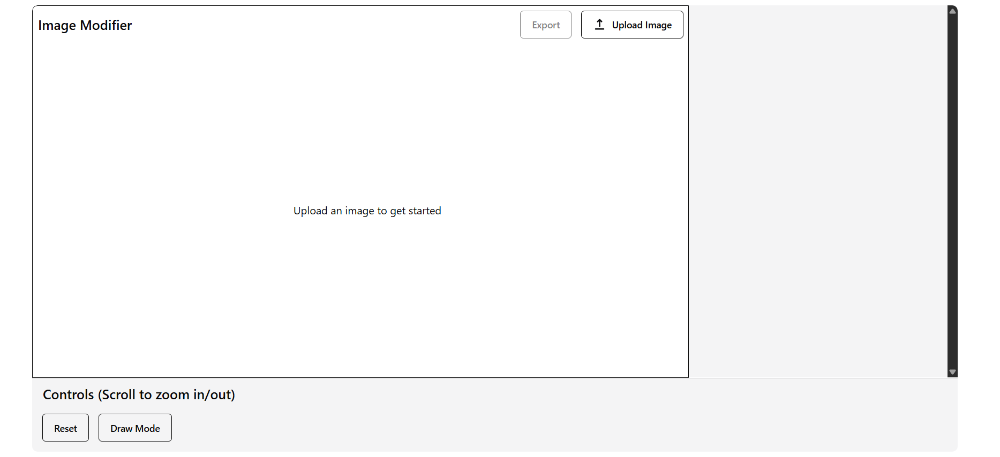
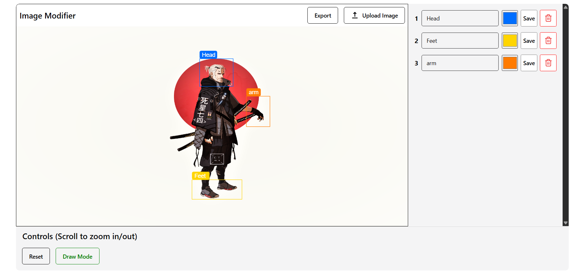
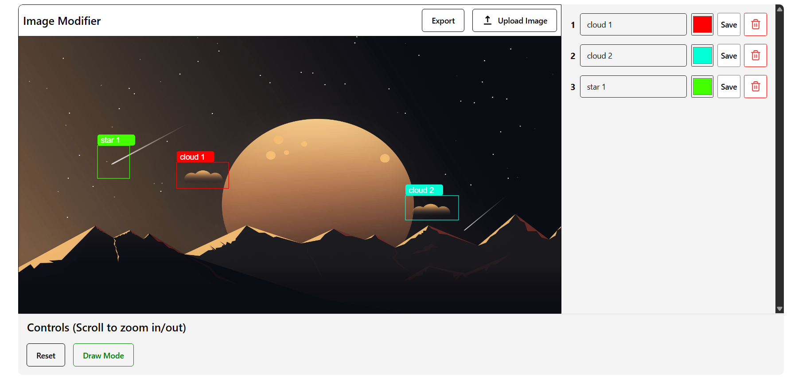
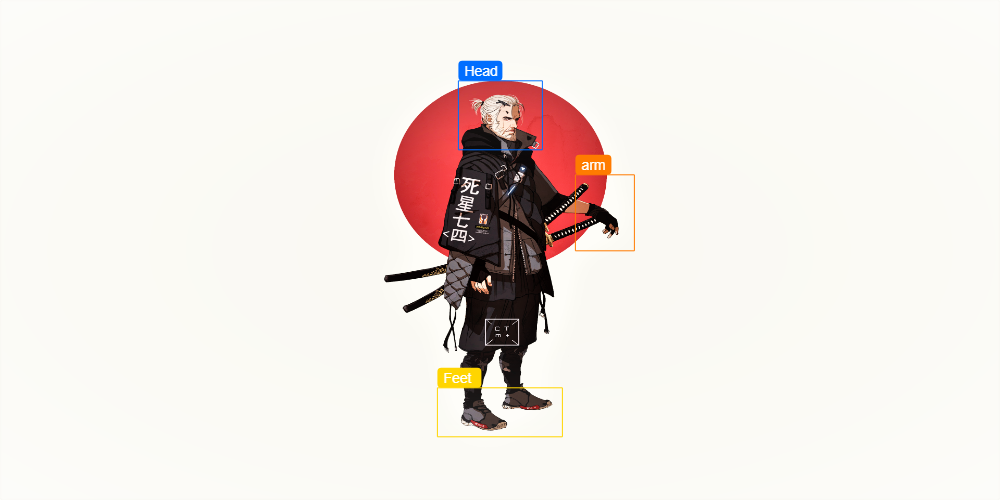
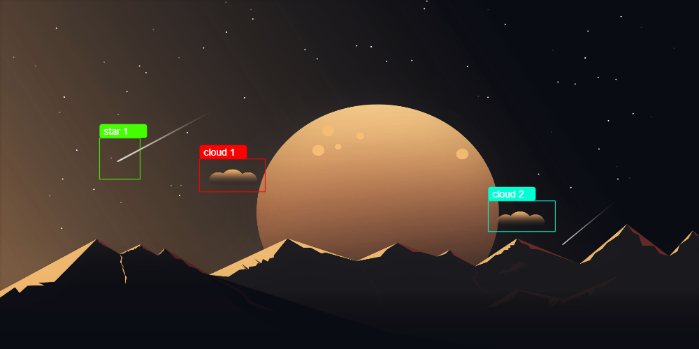
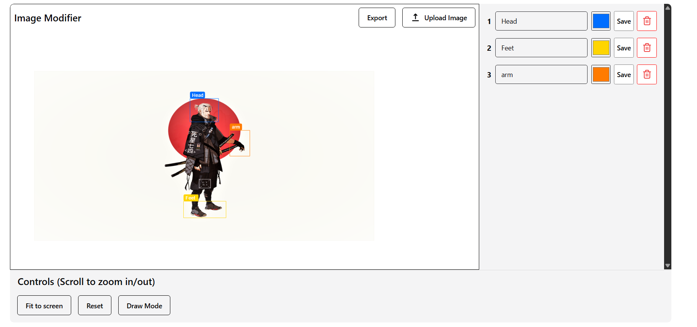

# Loopr Image analyzer Assignment Submission

## Table of contents

- [Overview](#overview)
  - [Personal](#personal)
  - [Objective](#objective)
  - [Screenshot](#screenshot)
  - [Links](#links)
- [My process](#my-process)
  - [Built with](#built-with)

## Overview

### Personal

This git repository is for the Loopr assignment submission.

Submission by:  
Name: **Mohsin Miyaji**  
Email: **mohsin.kmiyaji@gmail.com**

### Objective

- Allow users to upload their own image and draw rectangles with labels.
- Provide the ability to drag and zoom while keeping the rectangles in the same position.
- Ensure the user is able to download the final result when completed.

### Screenshot

  
  
  
  
  

### Links

- GitHub URL: [Add solution URL here](https://github.com/mohsin316/image-selection)
- Live Site URL: [Add live site URL here](https://image-selection-ivory.vercel.app/)

## My process

I built this project using **React** and **TypeScript** with **Vite** as the bundler.  
The main functionality [drawing/zooming/etc.] was implemented using **Konva**.  
For styling and components, I used **Chakra-ui**.  
Deployment was done using **Vercel**.

### Built with

- Semantic HTML5 markup
- CSS custom properties
- Flexbox & CSS Grid
- **React**
- **TypeScript**
- **Vite**
- **Chakra-ui**
- **Konva**
- **Vercel**
